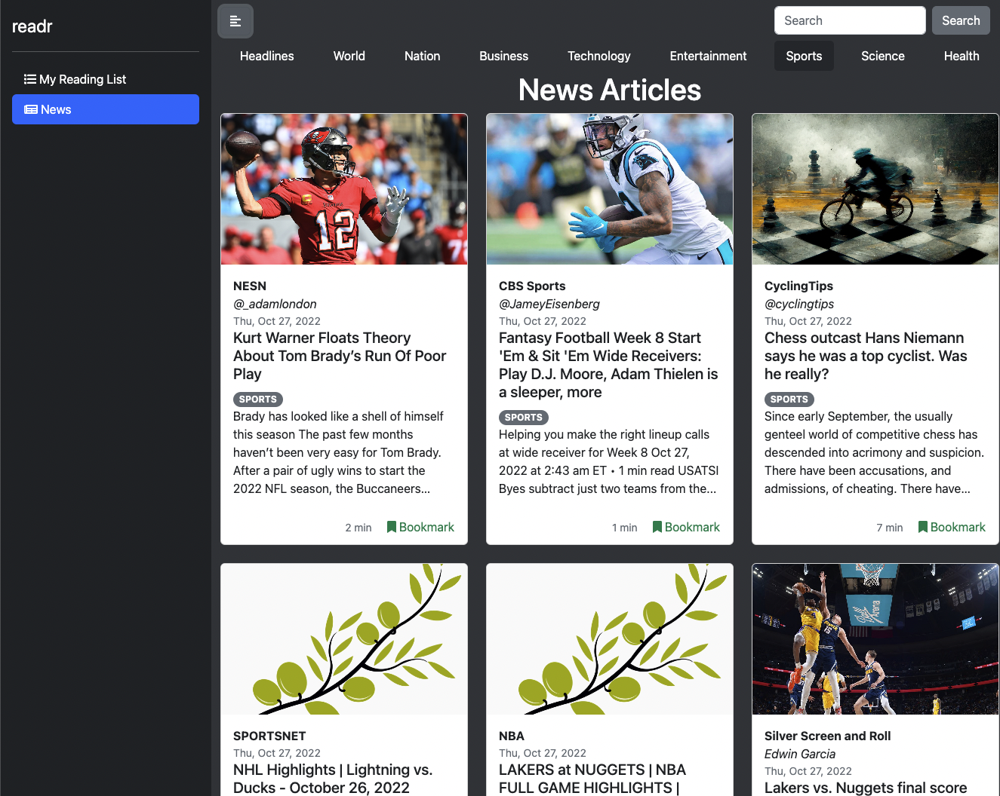
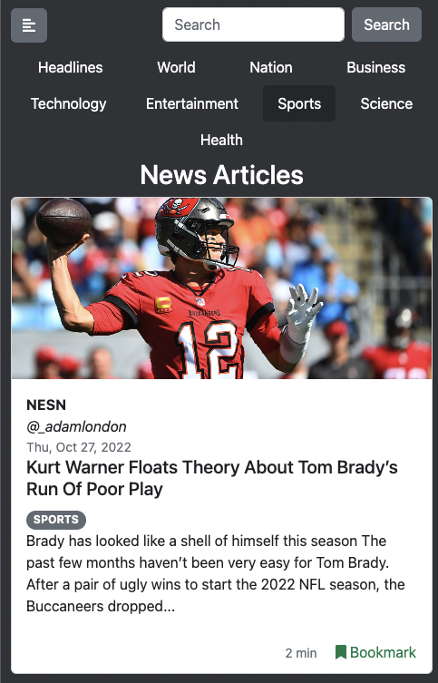
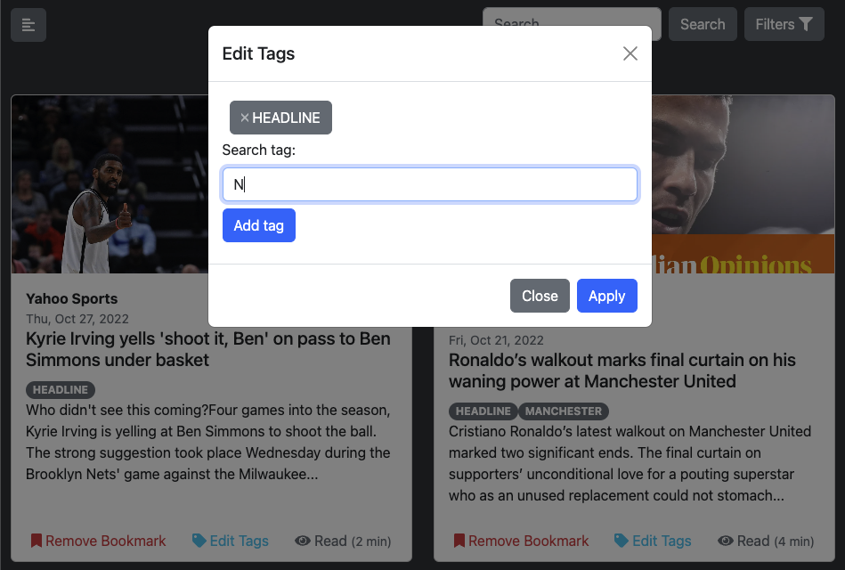
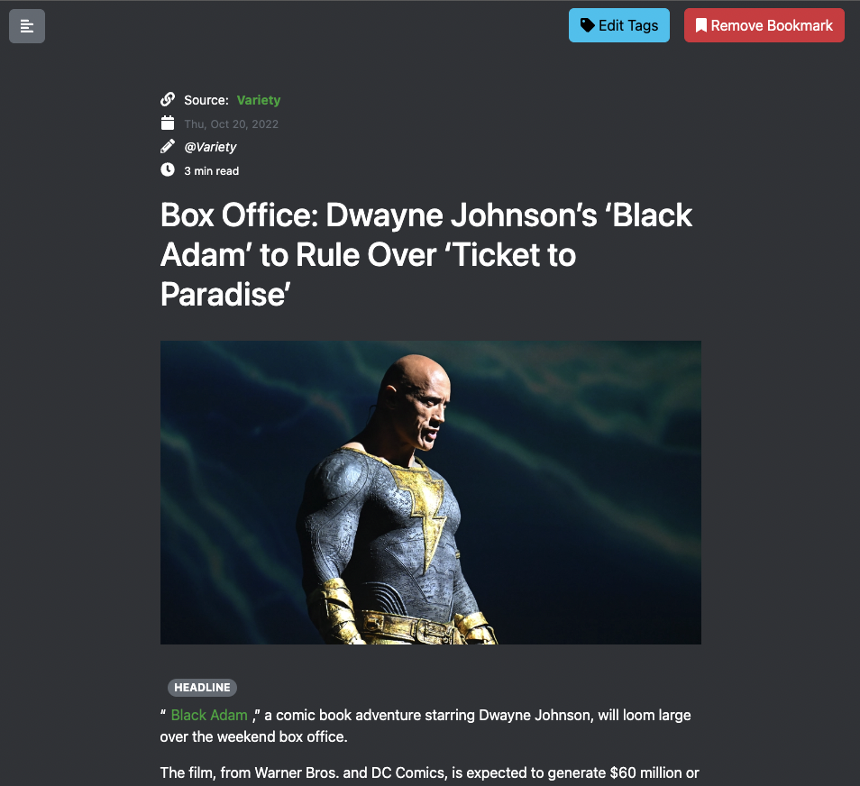

# readr

A news aggregation site built using Express, EJS, Bootstrap, jQuery, Font Awesome, Postgres, Prisma ORM, and AWS S3. The articles shown are sourced from Google News.

## Features

- Responsive Design

  - Regular
  

  - Small
  

- Browse articles by keyword or category
- User accounts
- Logged in users may make their own personalised list of articles that interest them by bookmarking articles
- Bookmarked articles can be tagged for convenience
  

- Bookmarked articles can also be opened in a simple reader view
  

## Credits:

Flat-icon:
<a target="_blank" href="https://icons8.com/icon/532/news">News</a> icon by <a target="_blank" href="https://icons8.com">Icons8</a>
